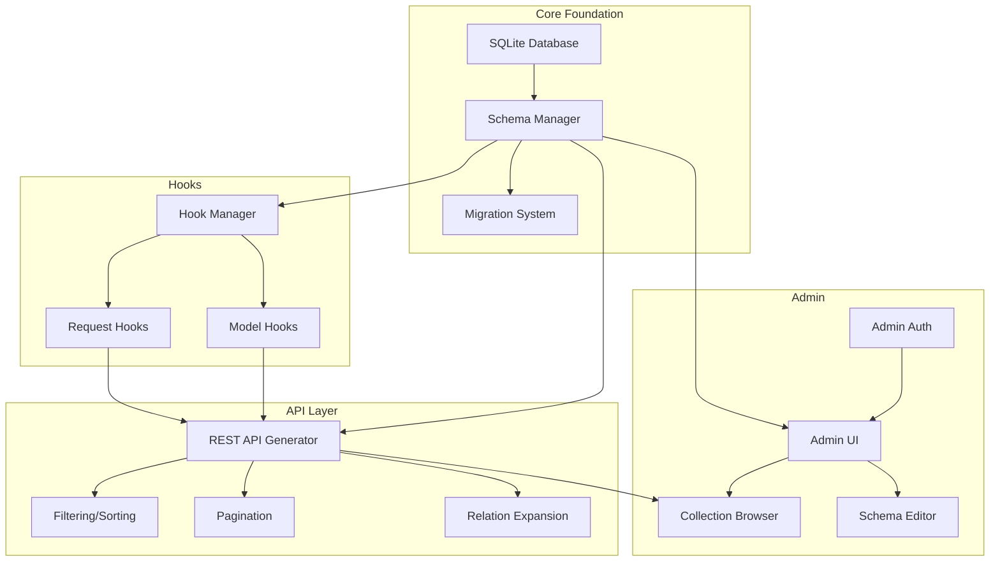

# Features Research: BunBase

## Executive Summary

This document analyzes the feature set of backend-in-a-box products (primarily PocketBase) to inform BunBase v0.1 requirements. Features are categorized as table stakes (must-have), differentiators (competitive advantage), and anti-features (deliberately out of scope for v0.1).

**Research Date**: 2026-01-24

---

## Table Stakes (Must Have)

Features users expect from any backend-in-a-box product. Missing these causes immediate abandonment.

### Schema/Collections

| Feature | Complexity | Notes |
|---------|------------|-------|
| Collection CRUD (create, read, update, delete collections) | Medium | Core functionality - users must define data structures |
| Multiple collection types (base, auth) | Medium | PocketBase has base, auth, and view types |
| System fields (id, created, updated) | Low | Auto-managed timestamps expected |
| Field validation (required, unique) | Medium | Basic data integrity |
| Indexes for performance | Medium | Required for any serious usage |
| Migration system | High | Schema evolution over time |
| Collection metadata storage | Low | Internal tracking of schema |

### Field Types (Core Set for v0.1)

| Field Type | Complexity | Priority | Notes |
|------------|------------|----------|-------|
| Text/String | Low | Must have | Basic string storage |
| Number (int/float) | Low | Must have | Numeric values |
| Boolean | Low | Must have | True/false flags |
| DateTime | Low | Must have | Timestamps, dates |
| JSON | Medium | Must have | Flexible nested data |
| Relation (foreign key) | Medium | Must have | Links between collections |
| Email | Low | Nice to have | Validated email strings |
| URL | Low | Nice to have | Validated URL strings |
| Select (single/multi) | Medium | v0.2 | Enum-style choices |
| Editor (rich text) | Medium | v0.2 | HTML content |
| File | High | v0.2 (out of scope) | Requires storage layer |
| GeoPoint | Medium | v0.2+ | Coordinates storage |
| Autodate | Low | Should have | Auto-set on create/update |

### API Generation

| Feature | Complexity | Notes |
|---------|------------|-------|
| Auto-generated REST endpoints | Medium | Core value proposition |
| List/paginate records | Medium | With page/perPage params |
| View single record | Low | GET by ID |
| Create record | Low | POST with validation |
| Update record (PATCH) | Low | Partial updates |
| Delete record | Low | Hard delete |
| Filtering with operators | High | `=`, `!=`, `>`, `<`, `~` (like), etc. |
| Sorting (ASC/DESC) | Low | `-field` for DESC, `+field` for ASC |
| Field selection | Medium | Return only requested fields |
| Relation expansion | High | Auto-fetch related records |

**PocketBase Filter Operators:**
- `=`, `!=` - equality
- `>`, `>=`, `<`, `<=` - comparison
- `~` - like/contains (auto-wrapped with wildcards)
- `!~` - not like
- `?=`, `?>`, etc. - "any of" for array fields
- `&&`, `||` - AND, OR
- Parentheses for grouping

### Admin UI

| Feature | Complexity | Notes |
|---------|------------|-------|
| Collection browser | Medium | List all collections |
| Record browser with pagination | Medium | View/search records |
| Record create/edit forms | Medium | Auto-generated from schema |
| Record delete | Low | With confirmation |
| Collection schema editor | High | Add/edit/remove fields |
| Settings page | Low | Basic app configuration |
| Dashboard overview | Low | Quick stats/health |
| Responsive design | Medium | Works on mobile |

### Authentication (Admin-only for v0.1)

| Feature | Complexity | Notes |
|---------|------------|-------|
| Admin login | Low | Protect admin UI |
| Session/token management | Medium | JWT or session-based |
| Admin password change | Low | Basic security |
| Protected API routes | Low | Admin endpoints only |

---

## Differentiators

Features that could set BunBase apart from competitors.

### TypeScript-First DX

| Feature | Why It Matters |
|---------|----------------|
| Full TypeScript codebase | JS developers can extend without learning Go |
| Type-safe hooks | Catch errors at compile time |
| npm ecosystem access | Use any npm package in hooks |
| Modern JS patterns | async/await, ESM, no callbacks |

### Bun Runtime Advantages

| Feature | Why It Matters |
|---------|----------------|
| Native SQLite support | No external bindings needed |
| Fast startup times | Sub-100ms cold starts |
| Built-in test runner | No Jest/Vitest setup needed |
| Single binary compilation | `bun build --compile` |

### Developer Experience

| Feature | Why It Matters |
|---------|----------------|
| Hot reload in development | Faster iteration |
| Better error messages | TypeScript stack traces |
| Simpler extension model | No Go knowledge required |
| Modern React admin | Familiar UI framework |

### Hooks System (v0.1 Priority)

| Feature | Complexity | Notes |
|---------|------------|-------|
| beforeCreate hook | Medium | Validate/modify before insert |
| afterCreate hook | Medium | Side effects after insert |
| beforeUpdate hook | Medium | Validate/modify before update |
| afterUpdate hook | Medium | Side effects after update |
| beforeDelete hook | Medium | Prevent or log deletions |
| afterDelete hook | Medium | Cleanup after deletion |
| Request-level hooks | Medium | Before/after API requests |
| Collection-specific hooks | Medium | Filter by collection name |
| Async hook support | Medium | Await external services |

**PocketBase Hook Categories (for reference):**
- App lifecycle: OnBootstrap, OnServe, OnTerminate
- Record model: OnRecordCreate, OnRecordUpdate, OnRecordDelete
- Record API: OnRecordCreateRequest, OnRecordUpdateRequest, OnRecordDeleteRequest
- Collection model: OnCollectionCreate, OnCollectionUpdate, OnCollectionDelete
- Auth: OnRecordAuthRequest, OnRecordAuthWithPasswordRequest
- Mail: OnMailerSend, OnMailerRecordVerificationSend
- Realtime: OnRealtimeConnectRequest, OnRealtimeSubscribeRequest
- File: OnFileDownloadRequest

### Future AI-Native Features (v0.2+)

| Feature | Why It Matters |
|---------|----------------|
| Natural language queries | "Show orders over $100 from last week" |
| AI agents as collections | First-class agent management |
| Auto-generated hooks from prompts | Describe behavior, get code |
| Agent-as-endpoint pattern | Expose AI directly via REST |

---

## Anti-Features (v0.1 Out of Scope)

Features to deliberately skip in v0.1 and why.

### Realtime/SSE Subscriptions

**Reason**: Adds significant complexity (WebSocket/SSE infrastructure, subscription management, event broadcasting). REST-only is sufficient to validate core concept.

**Complexity**: High
**Dependencies**: Event system, connection management, subscription tracking
**Defer to**: v0.2

### File/Image Uploads

**Reason**: Requires storage layer (local filesystem or S3), thumbnail generation, MIME type handling, upload size limits. Significant scope increase.

**Complexity**: High
**Dependencies**: Storage abstraction, file serving routes, collection field type
**Defer to**: v0.2

### User Authentication (Email/Password, OAuth)

**Reason**: Admin-only auth sufficient for v0.1. Full user auth requires email verification, password reset, OAuth provider integration, session management. v0.1 proves the core backend works.

**Complexity**: Very High
**Dependencies**: Email sending, token management, OAuth callbacks
**Defer to**: v0.2

### Password Reset Flow

**Reason**: No user auth in v0.1 means no password reset needed. Admin can be reset manually if needed.

**Complexity**: Medium
**Dependencies**: User auth, email sending
**Defer to**: v0.2

### Email Sending

**Reason**: Only needed for user auth flows. Admin-only v0.1 doesn't require it.

**Complexity**: Medium
**Dependencies**: SMTP config, templates
**Defer to**: v0.2

### GraphQL API

**Reason**: REST is sufficient. GraphQL adds complexity without proving core concept.

**Complexity**: High
**Dependencies**: Schema generation, resolver system
**Defer to**: v0.3+

### PostgreSQL Support

**Reason**: SQLite is simpler, embedded, and sufficient for v0.1. PG support adds connection pooling, different SQL dialects, deployment complexity.

**Complexity**: High
**Dependencies**: Connection management, SQL abstraction
**Defer to**: v0.2+

### CLI Scaffolding Tool

**Reason**: Manual setup is fine for v0.1. Focus on core runtime, not DX tooling.

**Complexity**: Medium
**Dependencies**: Template system, config generation
**Defer to**: v0.2

### Multi-tenancy

**Reason**: Single-tenant sufficient for MVP. Multi-tenancy is enterprise feature.

**Complexity**: Very High
**Dependencies**: Tenant isolation, data partitioning
**Defer to**: v0.3+

### View Collections (SQL-based)

**Reason**: Nice-to-have but not essential for v0.1. Base collections sufficient.

**Complexity**: Medium
**Dependencies**: SQL parser, read-only enforcement
**Defer to**: v0.2

### Batch Operations

**Reason**: Individual CRUD sufficient for v0.1. Batch adds transaction complexity.

**Complexity**: Medium
**Dependencies**: Transaction management
**Defer to**: v0.2

### MFA/OTP

**Reason**: Advanced auth feature. Admin-only v0.1 doesn't need it.

**Complexity**: High
**Dependencies**: TOTP implementation, QR codes
**Defer to**: v0.3+

---

## Feature Dependencies

### Build Order (Suggested)

1. **Phase 1**: SQLite Database + Schema Manager
2. **Phase 2**: Migration System
3. **Phase 3**: REST API Generator (basic CRUD)
4. **Phase 4**: Filtering, Sorting, Pagination
5. **Phase 5**: Relation Expansion
6. **Phase 6**: Hook Manager + Model Hooks
7. **Phase 7**: Admin Authentication
8. **Phase 8**: Admin UI (Collection Browser)
9. **Phase 9**: Admin UI (Schema Editor)
10. **Phase 10**: Single Binary Compilation

---

## PocketBase Feature Parity Checklist

### v0.1 Target (Must Have)

- [x] Collection creation/management
- [x] Basic field types (text, number, bool, datetime)
- [x] JSON field type
- [x] Relation field type
- [x] Auto-generated REST API
- [x] List records with pagination
- [x] Filter records
- [x] Sort records
- [x] CRUD operations
- [x] Lifecycle hooks (before/after)
- [x] Admin authentication
- [x] Admin UI (collection browser)
- [x] Admin UI (record editor)
- [x] SQLite embedded database
- [x] Single binary deployment

### v0.2 Target (Should Have)

- [ ] Email field type
- [ ] URL field type
- [ ] Select field type
- [ ] Editor (rich text) field type
- [ ] Autodate field type
- [ ] File field type + storage
- [ ] User authentication (email/password)
- [ ] OAuth2 providers
- [ ] Email verification
- [ ] Password reset
- [ ] Realtime/SSE subscriptions
- [ ] Batch operations
- [ ] View collections

### v0.3+ Target (Nice to Have)

- [ ] GeoPoint field type
- [ ] MFA/OTP support
- [ ] Multi-tenancy
- [ ] PostgreSQL support
- [ ] GraphQL API
- [ ] CLI scaffolding tool
- [ ] Plugin system

---

## Complexity Assessment Summary

| Category | Low | Medium | High |
|----------|-----|--------|------|
| Schema/Collections | 3 | 3 | 1 |
| Field Types (v0.1) | 4 | 2 | 0 |
| API Generation | 3 | 3 | 2 |
| Admin UI | 2 | 4 | 1 |
| Hooks | 0 | 7 | 0 |
| **Total v0.1** | **12** | **19** | **4** |

**Estimated v0.1 Effort**: ~35 feature units (2-3 weekend sprints)

---

## Sources

- [PocketBase Documentation](https://pocketbase.io/docs/)
- [PocketBase GitHub](https://github.com/pocketbase/pocketbase)
- [PocketBase API Collections Reference](https://pocketbase.io/docs/api-collections/)
- [PocketBase API Records Reference](https://pocketbase.io/docs/api-records/)
- [PocketBase API Rules and Filters](https://pocketbase.io/docs/api-rules-and-filters/)
- [PocketBase Event Hooks (Go)](https://pocketbase.io/docs/go-event-hooks/)
- [PocketBase Collections Documentation](https://pocketbase.io/docs/collections/)
- [PocketBase Framework Extension](https://pocketbase.io/docs/use-as-framework/)
- [What is PocketBase? - Better Stack](https://betterstack.com/community/guides/database-platforms/pocketbase-backend/)
- [Supabase vs Firebase vs PocketBase - Supadex](https://www.supadex.app/blog/supabase-vs-firebase-vs-pocketbase-which-one-should-you-choose-in-2025)
- [BaaS Solutions Comparison - Elest.io](https://blog.elest.io/best-free-open-source-backend-as-a-service-solutions/)
- [Appwrite vs Supabase - Appwrite](https://appwrite.io/blog/post/appwrite-compared-to-supabase)
- [Backend as a Service Guide - FreeCodeCamp](https://www.freecodecamp.org/news/backend-as-a-service-beginners-guide/)
- [Admin Dashboard Features - DronaHQ](https://www.dronahq.com/admin-panel-features/)

---

*Last updated: 2026-01-24*
